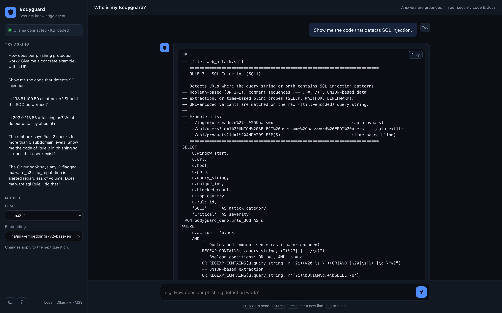
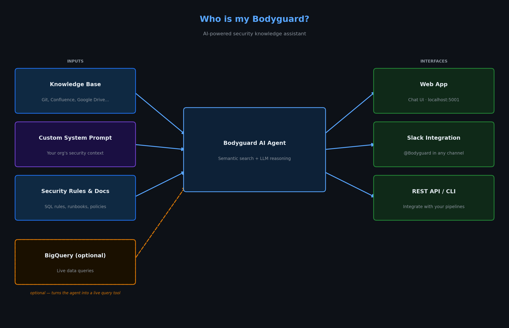
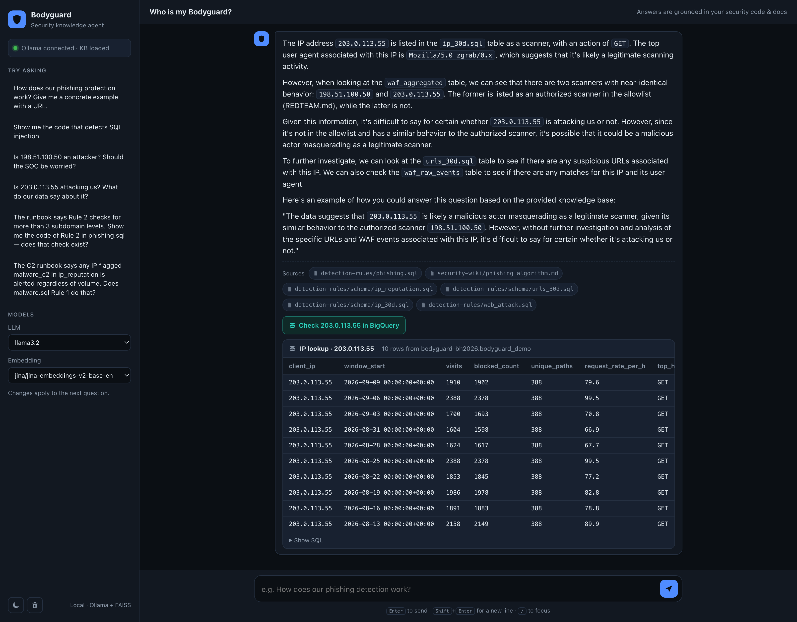

[](LICENSE)


# Who is my Bodyguard?

_Presented at [Black Hat SecTor 2026 Arsenal — "Who is my Bodyguard? Demystifying Enterprise Security Rules with an AI Agent"](https://blackhat.com/sector/arsenal/schedule/index.html#who-is-my-bodyguard-demystifying-enterprise-security-rules-with-an-ai-agent-54853)_

> The greatest blind spot in enterprise security isn't a zero-day — it's the gap between what your documentation says and what is actually running in production.

**Bodyguard** is an AI agent that bridges that gap.

It ingests your security code (SQL detection rules, Python logic) and your documentation (Confluence pages, Markdown runbooks), builds a knowledge base, and lets anyone — engineers or leadership — ask plain-language questions about the real, deployed defences. Every answer names the file it came from, and when you ask for the code you get the code.



---

## Table of Contents

1. [Architecture](#architecture)
2. [Use Cases](#use-cases)
3. [Quick Start — Local](#quick-start--local)
4. [Quick Start — Docker](#quick-start--docker)
5. [Walkthrough](#walkthrough)
6. [Live Data with BigQuery (optional)](#live-data-with-bigquery-optional)
7. [Customising the Agent — prompts.md](#customising-the-agent--promptsmd)
8. [Choosing Models](#choosing-models)
9. [Adding Your Own Knowledge Base](#adding-your-own-knowledge-base)
10. [Slack Integration](#slack-integration)
11. [REST API](#rest-api)
12. [Development](#development)

---

## Architecture

Bodyguard ingests security code and documentation into a knowledge base, then answers plain-language questions grounded in that KB — optionally running live queries against BigQuery to show real examples.



The stack is entirely local: [Ollama](https://ollama.com) for LLM inference and embeddings, [FAISS](https://faiss.ai) for vector search, BM25 for keyword search. No cloud account or API key is required to run the core agent.

Three design choices matter for answer quality:

- **One detection rule = one chunk.** SQL files are split at statement boundaries, so a rule's header comment, its `WHERE` clause and its example hits always travel together. A rule split in half — or buried in a whole file of unrelated rules — retrieves badly and pushes the LLM to guess.
- **Hybrid retrieval.** Security questions are full of literal tokens (`SQL injection`, `DDoS`, `CF_PHISHING_001`) that embedding models routinely miss. Results from BM25 and dense (MMR) search are fused with reciprocal rank fusion, capped at two chunks per file so one long runbook cannot crowd out the code.
- **A real system role, a large window.** The agent talks to Ollama's chat endpoint so the system prompt is honoured, with a 16k-token context — Ollama's 2k default is smaller than the prompt itself and would silently truncate it.

---

## Use Cases

The talk abstract makes three promises: **theory vs. reality** (documentation is not what runs in production), **data-driven leadership decisions** (based on field reality, not buzzword pages), and **breaking team silos** (teams understanding each other's protections). Each use case below maps to one of them and is reproducible on the bundled demo knowledge base, which lives in two places on purpose — the way it does in real organisations:

- [`test/demo/detection-rules/`](test/demo/detection-rules/) — *the code.* A fictional detection repo owned by three teams (`brand-protection-team`, `threat-hunting-team`, `appsec-team`), nine BigQuery SQL rules, and the schemas of the four tables they read (`urls_30d`, `domains_30d`, `ip_30d`, `ip_reputation`) with sample rows.
- [`test/demo/security-wiki/`](test/demo/security-wiki/) — *the documentation.* Three runbooks, one per team, each of which has drifted from the code in the ways real runbooks do: a control that was never implemented, a threshold that was "tuned" only on the page, a data source that the code stopped reading, a rule number that does not exist.

Everything is fictional. IP addresses are RFC 5737 documentation ranges and ASNs are RFC 5398 documentation numbers, so nothing in the demo points at a real network.

Quoted results were produced with the default `llama3.2` (3B) model.

### 1. Theory vs. reality — the phantom control

> **The runbook says Rule 2 checks for more than 3 subdomain levels. Show me the code of Rule 2 in phishing.sql — does that check exist?**

`phishing_algorithm.md` states that Rule 2 flags "an unusually deep subdomain chain (more than 3 levels)" and even lists its false-positive risk. The code in `phishing.sql` has no such condition — Rule 2 filters on a credential-path regex and `typosquatting_score >= 0.5`, nothing else. The agent prints the rule verbatim, so the evidence is on screen.

*Why it matters:* management believes a control exists because a page says so. Nobody would have opened the SQL to check. This is the blind spot the tool exists for.

> With the 3B model the quoted code is exact but the one-line verdict is shaky (it once "confirmed" the missing check in the same breath as denying it). An 8B+ model gets the verdict right — see [Choosing Models](#choosing-models).

The other two runbooks drift too, each in a different way. Ask about them the same way — "the runbook says X, show me the code":

| Runbook says | Code does | Ask |
|---|---|---|
| `phishing_algorithm.md`: pipeline is `waf_raw_events → waf_aggregated`; brands matched by regex | reads `domains_30d` / `urls_30d`; uses a precomputed `typosquatting_score` | *Which tables does the phishing detection read?* |
| `c2_detection_runbook.md`: C2 threshold is 50 req/h; any `malware_c2` IP in `ip_reputation` is alerted regardless of volume; Tor-sourced beacons covered | threshold is 100; `malware.sql` never joins `ip_reputation`; rule requires `is_datacenter = TRUE`, so Tor exits are excluded | *Does malware.sql Rule 1 use the reputation feed?* |
| `web_attack_coverage.md`: DDoS threshold 500 req/h; "Rule 2b" covers Tor floods; "Rule 4" detects scanners; SQLi covers stacked queries | threshold is 1000; the only trace of Tor is a comment saying "separate rule for Tor" — there is none; there is no Rule 4; no `;` pattern in the SQLi regex | *Is there a detection rule for vulnerability scanners?* |

The third row is the leadership case: a coverage matrix presented at a quarterly risk review, with two rules that do not exist.

### 2. Leadership decision — "what do we already have?"

> **We are evaluating a commercial anti-phishing service. What do we already detect in-house today, and what are the documented gaps?**

The agent answers with the three in-house rules and their severities (brand impersonation · High, credential harvesting · Critical, token theft · High) and the four documented limitations (HTTPS blind spots on unproxied infrastructure, no ML scoring, URL-encoding evasion, false-positive risk) — citing the runbook and the tables involved.

*Why it matters:* that is a purchasing decision made on field reality in thirty seconds, not on a vendor deck. And note what it inherits: the summary repeats the runbook's claim about deep-subdomain checks — which use case 1 just showed to be fiction. Theory propagates until someone asks for the code.

### 3. Breaking silos — "what does the other team already do?"

> **I'm on the AppSec team. Before we build our own C2 beaconing detection, what does the threat-hunting team already detect, and how?**

The agent describes the `threat-hunting-team` rule in `malware.sql`: datacenter IPs with a high request rate, very few unique paths, low error rate, POST method and a non-browser user agent — and names the owning team and Slack channel from the file header.

*Why it matters:* the AppSec team was about to duplicate a control that another team ships. Understanding each other's rules is how teams stop building the same thing twice and start composing.

### 4. Engineer onboarding — "show me the code"

> **Show me the code that detects SQL injection.**

The agent extracts the actual `WHERE` clause from `web_attack.sql` — the regexes for quotes and comment sequences, `UNION … SELECT`, time-based probes — in a copyable code block, and names the file. It quotes the logic; it does not paraphrase it.

*Why it matters:* the answer is verifiable in one click, which is what makes the leadership answers above trustworthy too.

### 5. SOC triage with organisational context

> **Is 198.51.100.50 an attacker? Should the SOC be worried?**

In the data, `198.51.100.50` looks exactly like a hostile scanner: 412 unique paths, 98 % blocked, a `Nuclei` user agent — and the `ip_reputation` feed duly lists it as a `scanner`. Only [`REDTEAM.md`](REDTEAM.md) knows it is the internal red team. The expected answer: an authorised red-team scanner, not an attacker — the SOC can stand down.

*Why it matters:* the allowlist is organisational knowledge that never lives in the detection code or in a threat feed. Feeding it to the agent turns a false-positive investigation into a one-line answer.

> On the default 3B model this verdict is unreliable: in our runs it sometimes deflected with a question, or read the feed's `scanner` entry as hostile. The mechanism works — the IP row and `REDTEAM.md` are both in the context — but weighing "looks hostile" against "is authorised" is exactly the judgement an 8B+ model makes and a 3B does not. See [Choosing Models](#choosing-models).

### 6. Live verification — "what do our data actually say?"

> **Is 203.0.113.55 attacking us? What do our data say about it?**

Two scanners in the demo behave identically; this one is *not* on the allowlist. When the question names an IP address, the answer comes with a **Check 203.0.113.55 in BigQuery** button (see [Live Data with BigQuery](#live-data-with-bigquery-optional)). One click runs a parameterised lookup across `ip_30d` (every daily window) and `ip_reputation`, and the rows land under the answer: 388 unique paths, 99 % blocked, `zgrab` user agent, back every third day, `scanner` with 0.86 confidence in the feed. The agent's reading of the code and the warehouse's reading of the traffic are now side by side.

*Why it matters:* the agent explains what the rules would do; BigQuery shows what actually happened. Neither alone settles a triage question. Try the same with an address the knowledge base has never seen — the lookup still runs, and an empty result is itself an answer.

> On the 3B model this is also the most honest demo of the tool's limits: asked about `203.0.113.55`, `llama3.2` once labelled it a DDoS source "exceeding 1000 requests per hour" because the DDoS rule was in its context. The BigQuery rows underneath said 79.6 req/h and `scanner`. The data corrected the model in front of the audience — which is the point of having the button.

### 7. Honest boundaries

> **Do we have any host-level or EDR detections, or only network-level ones?**

The demo KB only contains network/WAF rules. The expected answer is *"I can't find that in the knowledge base"*, with the files that were checked — rather than an invented EDR programme. Ask it about the weather and it declines just as flatly.

*Why it matters:* a security assistant that fills gaps with plausible fiction is worse than no assistant.

> This is where the default 3B model is weakest: with three runbooks in the context it tends to answer the question it *can* answer (reciting a phishing rule) instead of the one asked. The off-topic refusal is reliable; the "not in the KB" refusal needs an 8B+ model — see [Choosing Models](#choosing-models).

### What the default model handles, and what it does not

Measured on the bundled KB with `llama3.2`: use cases 1–4 and 6 answer correctly, including the full inventory — *"What security rules do we have? List them all with their owning team"* returns all nine rules under their three teams. Triage verdicts (use case 5), the "not in the KB" refusal (use case 7) and gap analysis across topics (*"Are there any known gaps in our DDoS coverage?"*) are unreliable on 3B: the right chunks are retrieved, but the model borrows facts from a neighbouring rule or dodges the question. An 8B+ model is the fix; the model is selectable per question from the sidebar.

---

## Quick Start — Local

### Prerequisites

- Python 3.10+ (`make setup` picks the newest `python3.x` it finds; override with `SYSTEM_PYTHON=/path/to/python3.12`)
- [Ollama](https://ollama.com) running locally, with the default models pulled:

```bash
ollama pull jina/jina-embeddings-v2-base-en
ollama pull llama3.2
```

### Three commands to run

```bash
make setup    # create virtualenv + install dependencies
make build    # index the demo security rules into a local knowledge base
make run      # start the web app at http://localhost:5001
```

That's it. No cloud account or API key required.

### Other useful commands

```bash
make cli                              # interactive CLI instead of web app
make test                             # unit tests (after `make setup-dev`)
make build-github REPO=owner/repo     # build KB from a GitHub repository
make build-bq DATASET=project.ds      # build KB from a BigQuery dataset
make deploy-bq                        # deploy the demo tables to your BigQuery project
make help                             # everything else
```

### Manual (without Make)

```bash
python3.12 -m venv .venv && source .venv/bin/activate
pip install -r requirements.txt
python -m kb.builder --source test/demo --output vector_store
python -m web.app
```

---

## Quick Start — Docker

### Prerequisites

- Docker & Docker Compose
- Ollama on the host with the models pulled (see above). A fully containerised Ollama is also supported — see the comments in [`docker-compose.yml`](docker-compose.yml).

```bash
mkdir -p vector_store                          # the app runs as non-root; create the shared dir first
docker compose --profile build up kb-builder   # build the knowledge base (run once)
docker compose up bodyguard                    # start the web app
```

Open **http://localhost:5001**.

---

## Walkthrough

1. **Start the app** (`make setup && make build && make run`) and open http://localhost:5001. The status pill in the sidebar should read *Ollama connected · KB loaded*.
2. **Click a suggested question** or type your own. Answers stream in, with the source files listed underneath.
3. **Ask for code**: *"Show me the code that detects SQL injection."* — you get the real `WHERE` clause with a Copy button.
4. **Test the guardrail**: *"What is the weather today?"* — the agent declines.
5. **Switch models** from the sidebar (any model available on your Ollama host). The change applies to the next question, no restart needed.

The screenshot at the top of this page is step 3: the agent returns the actual `WHERE` clause of the SQL-injection rule, with the files it came from listed underneath.

---

## Live Data with BigQuery (optional)

> Without BigQuery, Bodyguard is a fully functional RAG agent. BigQuery elevates it from an LLM that _describes_ your security rules to an agent that can **show real rows** behind them.

Two kinds of live query, both read-only:

- **Entity lookup.** When the question names an IPv4 address, the button reads **Check `<ip>` in BigQuery** and runs a parameterised lookup of that address across `ip_30d` (all daily windows) and `ip_reputation`. The address is bound as a query parameter, never interpolated into SQL. This works even when the agent had nothing to say about the IP — an unknown address is exactly when checking the data matters.
- **Topic example.** Otherwise, when the answer is about a detection topic (phishing, malware/C2, XSS, SQLi, DDoS, IP reputation), the button reads **Run a live example in BigQuery** and runs a matching sample query over the most recent daily window.

Rows render inline under the answer, with the SQL one click away.



### The demo dataset

Four tables in `<BQ_PROJECT>.<BQ_DATASET>`, built from the schema files in [`test/demo/detection-rules/schema/`](test/demo/detection-rules/schema/) — the same files the knowledge base is built from, so the code the agent quotes and the data it queries never disagree:

| Table | Rows | Content |
|---|---|---|
| `urls_30d` | ~360 | Gateway/WAF URL aggregates: path, query string, WAF rule and action |
| `domains_30d` | ~185 | Domain aggregates with WHOIS age, brand-similarity score, suspicious keywords |
| `ip_30d` | ~285 | Source-IP behaviour: rate, path diversity, block rate, method, UA, top host |
| `ip_reputation` | 10 | Threat-intelligence feed merge: category, source feed, confidence |

Each schema file carries one daily window of sample rows. The deploy script expands the three `*_30d` tables to 30 daily windows with deterministic jitter and some realism — young phishing domains exist only from their registration day, DDoS bots burst on two days, scanners return every third day — then shifts every window so the latest one is yesterday.

### Deploy the demo dataset to your own project

```bash
gcloud auth application-default login
make deploy-bq                              # = python scripts/deploy_bq.py --verify
```

`--verify` runs all nine detection rules against the freshly loaded tables and prints how many rows each returns; a rule that returns nothing is flagged. `make verify-bq` runs just that step later, `make check-demo` validates the schema files offline (column count vs. row arity) without touching BigQuery.

```bash
export BQ_PROJECT=<your-project>            # picked up by web.app and docker-compose
export BQ_DATASET=bodyguard_demo            # optional, this is the default
make run
```

The rule files reference tables as `bodyguard_demo.<table>`; the deploy script rewrites that to your project and dataset. Use a read-only service account if you point the app at real data.

You can also build the knowledge base *from* BigQuery — table schemas plus sample rows become documents:

```bash
python -m kb.builder --bigquery <your-project>.bodyguard_demo --output vector_store --force
```

---

## Customising the Agent — prompts.md

> **This is the most important file to edit before deploying Bodyguard in your environment.**

[`agent/prompts.md`](agent/prompts.md) **is** the system prompt — every line is sent to the LLM. It ships with general security knowledge (WAF concepts, phishing taxonomy, severity levels, evasion techniques) and strict grounding rules. Extend it with knowledge specific to your organisation and stack:

| Section | Examples |
|---|---|
| **Your data sources** | Schema of your SIEM tables, log field names, detection pipeline steps |
| **Your brand allowlist** | Legitimate domains and IPs your rules should never flag |
| **Your rule taxonomy** | Naming conventions, severity definitions, owner teams |
| **Your threat model** | Specific attack patterns, actors, or TTPs relevant to your environment |
| **Your red team** | See below — goes in a separate file |

Write for the model, not for people: anything explanatory you add will be read by the LLM as instructions.

### Red Team Configuration

Red team IPs and domains are kept out of the prompt file so they can be managed (and git-ignored) separately. [`REDTEAM.md`](REDTEAM.md) is appended to the system prompt at startup when present. Replace the example entries with your own ranges; if they are confidential, uncomment the `REDTEAM.md` line in `.gitignore`.

The prompt files are read when the agent loads. After editing either one, **restart the app** — no knowledge-base rebuild is needed.

---

## Choosing Models

Everything runs through Ollama, so any model you can `ollama pull` works. Switch with the sidebar dropdowns, or set defaults with `LLM_MODEL` / `EMBED_MODEL`.

| Task | Default | Works well for | Consider upgrading to |
|---|---|---|---|
| LLM | `llama3.2` (3B, ~2 GB) | concrete examples, code extraction, rule inventories, drift questions where the code is the evidence | `qwen3:8b`, `llama3.1:8b` or `gemma3:12b` for triage verdicts ("is this IP an attacker?"), honest "not in the KB" answers and gap analysis |
| Embeddings | `jina/jina-embeddings-v2-base-en` | the demo KB — measured as good as or better than `nomic-embed-text` on it | `nomic-embed-text`, `mxbai-embed-large` or `qwen3-embedding` if your own corpus retrieves poorly; check with the retrieval diagnostics in `CLAUDE.md` before switching, and rebuild the KB afterwards (`make build`) |

The default pair keeps the download under 2.5 GB so the demo runs on any laptop. On a machine with 16 GB+ of RAM an 8B model is the better daily driver. In our measurements the retrieval settings (hybrid search, one rule per chunk, eight slots) mattered more than the embedding model; once the right chunks are in the context, what a larger model adds is following the grounding rules — negation ("does this check exist?"), refusing to borrow another rule's facts, and saying "the KB does not cover this" instead of improvising.

---

## Adding Your Own Knowledge Base

```bash
# Local directory
python -m kb.builder --source /path/to/your/security/repo --output vector_store --force

# GitHub repository
GITHUB_TOKEN=<token> python -m kb.builder --github myorg/security-rules --output vector_store --force

# BigQuery dataset (schemas + sample rows)
python -m kb.builder --bigquery project.dataset --output vector_store --force
```

Supported file types: `.sql` (one chunk per statement), `.md` (split on headings), `.py`, `.txt`. The architecture supports any LangChain document loader (Confluence, Google Drive, …).

---

## Slack Integration

### Setup

1. Create a Slack App at <https://api.slack.com/apps>.
2. Add OAuth scopes: `app_mentions:read`, `chat:write`, `im:history`, `im:read`.
3. Enable **Socket Mode** and generate an **App-Level Token** (`xapp-…`).
4. Install the app to your workspace.

### Run

```bash
export SLACK_BOT_TOKEN=xoxb-...
export SLACK_APP_TOKEN=xapp-...
make slack        # or: python -m slack.bot
```

The bot responds to `@Bodyguard <question>` in channels and to direct messages.

---

## REST API

The web app doubles as an API for pipelines and internal portals.

```bash
# One-shot answer
curl -s localhost:5001/ask -H 'Content-Type: application/json' \
     -d '{"question": "Show me the code that detects SQL injection."}'
# -> {"answer": "...", "sources": ["detection-rules/web_attack.sql", ...], "show_bq": true}

# Streaming (Server-Sent Events): {"token": "..."} events, then {"done": true, "sources": [...]}
curl -sN localhost:5001/ask/stream -H 'Content-Type: application/json' \
     -d '{"question": "How does our phishing protection work?"}'

# Health: Ollama reachability, KB presence, BigQuery availability
curl -s localhost:5001/health
```

Both `ask` endpoints accept optional `llm_model` and `embed_model` fields.

---

## Development

```bash
make setup-dev    # venv + runtime deps + pytest + matplotlib
make test         # unit tests (no Ollama needed)
make diagram      # regenerate static/architecture.png
```

```
agent/      core.py (hybrid retriever, RAG chain), prompts.md (system prompt)
kb/         builder.py — ingestion: local dir / GitHub / BigQuery → FAISS
web/        app.py (Flask + SSE), templates/index.html, static/app.{css,js}
slack/      bot.py — Socket Mode bot
scripts/    deploy_bq.py — demo dataset for BigQuery
test/demo/  the demo knowledge base: detection-rules/ (SQL, per team) + security-wiki/ (runbook)
tests/      pytest unit tests
REDTEAM.md  red-team allowlist appended to the prompt
```

---

## Authors

**Jordan Garzon** — [LinkedIn](https://www.linkedin.com/in/jordan-garzon/)
**Victor Arango** — [LinkedIn](https://www.linkedin.com/in/victor-arango-5a211611b/)

Released under the [MIT License](LICENSE).
